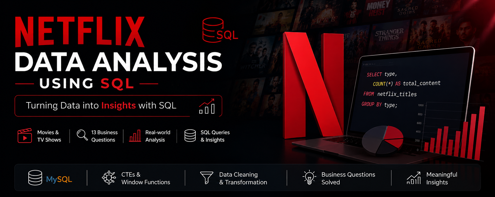

# 🎬 Netflix Data Analysis using SQL


# 🎬 Netflix Data Analysis using SQL

## 📌 Project Overview

This project focuses on analyzing Netflix content data using SQL. The dataset contains information about movies and TV shows available on Netflix, including directors, cast members, countries, ratings, release years, durations, genres, and descriptions.

The goal of this project was to solve real-world business problems using SQL queries and improve analytical thinking by first attempting each question independently and then validating the approach against reference solutions.

---

## 🧠 My Approach

This project was completed as a hands-on SQL practice challenge based on a Netflix dataset and a set of business questions.

Rather than directly following the provided solutions, I attempted each question independently first and then compared my approach with the reference solution. This process helped me:

- Strengthen SQL problem-solving skills
- Explore multiple ways to solve the same business problem
- Improve query optimization and readability
- Gain practical experience with real-world analytical scenarios
- Develop a deeper understanding of SQL functions, CTEs, and window functions

All 13 business questions were solved using SQL, focusing on both accuracy and efficient query design.

---

## 📂 Dataset

**Dataset:** Netflix Titles Dataset

The dataset contains information such as:

- Show ID
- Type (Movie / TV Show)
- Title
- Director
- Cast
- Country
- Date Added
- Release Year
- Rating
- Duration
- Genre
- Description

---

## 🛠️ Tools Used

- MySQL
- SQL Window Functions
- Common Table Expressions (CTEs)
- Aggregate Functions
- String Functions
- Date Functions
- GitHub

---

## 📊 Business Problems Solved

### 1. Count Movies vs TV Shows
Determine the distribution of content types available on Netflix.

### 2. Most Common Rating by Content Type
Identify the most frequently occurring rating for Movies and TV Shows.

### 3. Movies Released in a Specific Year
Retrieve all movies released in a given year (example: 2020).

### 4. Longest Movie on Netflix
Find the movie with the highest duration.

### 5. Content Added in the Last 5 Years
Analyze recently added content on Netflix.

### 6. Content Directed by Rajiv Chilaka
Retrieve all Movies and TV Shows directed by Rajiv Chilaka.

### 7. TV Shows with More Than 5 Seasons
Identify long-running TV shows available on Netflix.

### 8. Top 5 Years with Highest Netflix Content Releases in India
Analyze Netflix's content addition trend for India.

### 9. Documentary Movies
List all documentary-related content.

### 10. Content Without Director Information
Identify records with missing director details.

### 11. Salman Khan Movies Added in the Last 10 Years
Calculate the number of Netflix titles featuring Salman Khan.

### 12. Content Categorization Based on Description
Classify content as:
- **Bad** → Contains keywords such as *Kill* or *Violence*
- **Good** → All other content

### 13. Additional Data Cleaning & Transformation
Performed data preprocessing including:
- Date conversion
- Season extraction from duration field
- Handling missing values

---

## 💡 SQL Concepts Used

### Data Definition Language (DDL)
- CREATE DATABASE
- CREATE TABLE
- ALTER TABLE
- DROP TABLE

### Data Manipulation Language (DML)
- INSERT
- UPDATE

### Data Analysis Concepts
- GROUP BY
- ORDER BY
- LIMIT
- CASE WHEN
- Aggregate Functions
- Window Functions (`RANK()`)
- Common Table Expressions (CTEs)
- String Functions (`SUBSTRING_INDEX`, `TRIM`, `LOWER`)
- Date Functions (`STR_TO_DATE`, `YEAR`)
- Filtering using `LIKE`

---

## 📈 Key Learnings

Through this project, I gained hands-on experience with:

- Real-world SQL problem solving
- Data cleaning and preprocessing
- Writing optimized analytical queries
- Window functions and ranking techniques
- CTEs for complex analysis
- Converting business requirements into SQL solutions

---

## 📁 Project Structure

```
Netflix-SQL-Project/
│
├── netflix_titles.csv
├── SQL Project.sql
└── README.md
```

---

## 🚀 How to Run

1. Download the dataset.
2. Create a MySQL database.
3. Execute the table creation script.
4. Import the CSV file into MySQL.
5. Run the SQL queries from `SQL Project.sql`.

---

## 👨‍💻 Author

**Dharmik Shah**

Aspiring Data Analyst | SQL | Power BI | Excel

Connect with me on LinkedIn and feel free to explore my other data analytics projects.
